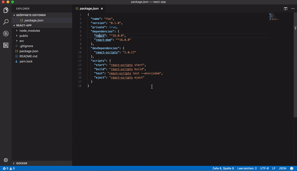

# npm-dependency-links

  

Links the depedencies in your package.json to their npmjs.com profile.

## Features

Visit the npmjs.com profile of your dependencies by simply `CMD/Ctrl+click` on the package name in your package.json.

## Custom Registry URL
To change the URL, you can set the configuration value in `settings.json` as below:

`"npmDependencyLinks.registryUrlPattern": "http://myCustomRegistry/{{pkg}}/package?queryparams"`

Note that `{{pkg}}` is the only part of the pattern that will be set by this extension. E.g., If your pattern is `http://registry.mysite.com/package?name={{pkg}}?version=latest`. If you click on `npm-dependency-links`, then the resulting URL will be `http://registry.mysite.com/package?name=npm-dependency-links?version=latest`

## Custom Registry URL (Legacy)
You can also pass custom registry url. For example, if you are using verdaccio. Default value is `https://www.npmjs.com/package/`.

To change the url, you need to set this configuration value in `settings.json`

`"npmDependencyLinks.registryUrl": "http://myCustomRegistry/"`

_Note: Don't forget to put `"/"` in the end._

## Requirements

Visual Studio Code > 1.17.0
